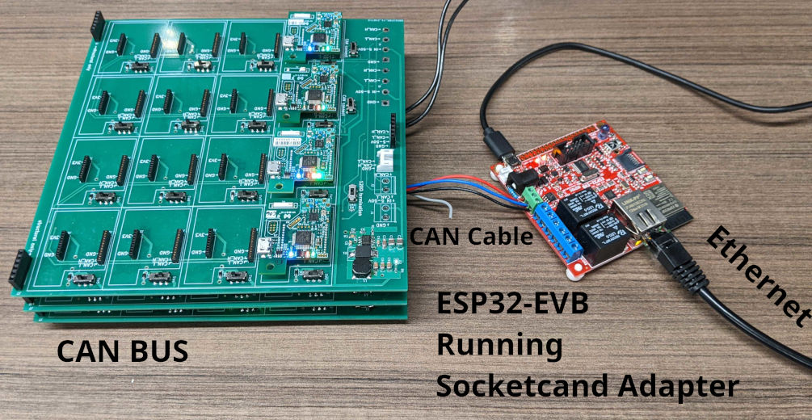

# esp32_socketcand_adapter

This is a program that lets the [Olimex ESP32-EVB](https://www.olimex.com/Products/IoT/ESP32/ESP32-EVB/open-source-hardware)
act as a [socketcand](https://github.com/linux-can/socketcand/) adapter.
It runs a server on port 29536 that translates traffic between TCP socketcand clients and its CAN bus.

Clients can connect to the adapter via TCP socketcand
to communicate with the CAN bus connected to the adapter.

```
Client1 <---TCP Socketcand---> |---------------------------|
                               | esp32_socketcand_adapter  |
Client2 <---TCP Socketcand---> |        running on         |
                               |     Olimex ESP32-EVB      |
Physical CAN bus (vcan0) <---> |---------------------------|
```

Here's an image of an example setup:



## Installation
The *Releases* page contains pre-built `esp32_socketcand_adapter.bin` files.
To flash them onto your ESP32 using
[Esptool](https://docs.espressif.com/projects/esptool/en/latest/esp32/), run this command:

```bash
esptool.py write_flash 0 esp32_socketcand_adapter.bin
```

To monitor log output from the ESP32 on Linux, run: \
(replace "/dev/ttyUSB0" with the port you're using)

```bash
tail -f /dev/ttyUSB0
```

Note: Flashing will fail if the port is being monitored.

## Build from source
Alternatively, you can build the project yourself.

1. Install [ESP-IDF](https://docs.espressif.com/projects/esp-idf/en/stable/esp32/get-started/).

2. Download this repository.

3. Run `idf.py build` to build the project.

3. Run `idf.py flash` to flash your ESP32.


## Setup

1. On startup, your ESP32 will print its curent network settings over USB UART.
Hold button `BUT1` for 1 second to reset the settings to default.
The default settings are:
    - Ethernet uses statically assigned IP:
        - Address: 192.168.2.163
        - Netmask: 255.255.255.0
        - Gateway: 192.168.2.1
    - Wi-Fi is disabled.
    - CAN bitrate is 500 kbit/s.

2. Use an ethernet cable to connect the ESP32 to your computer or a local network.

3. In a web browser, go to <http://192.168.2.163/>,
or whatever the ESP32's ethernet IP is.
You should see a web interface served by the ESP32 over HTTP.
Change network settings to your liking.

4. Connect the ESP32 to a CAN bus.

## Can-utils Candump Example

This example lets you listen to CAN packets from the ESP32 Socketcand Adapter. This example only works on Linux.

1. Install can-utils. On Debian: `sudo apt install can-utils`.

2. Install socketcand by following the instructions in
the [socketcand](https://github.com/linux-can/socketcand) repository.

3. Create a virtual CAN device: `sudo ip link add dev vcan0 type vcan`.

4. Enable the virtual CAN device: `sudo ip link set up vcan0`.

5. In the background, start `./socketcandcl -v --server [ESP32 IP ADDRESS] -i vcan0,vcan0`. Use the IP address of your ESP32. 

6. Print incoming CAN packets with `candump vcan0`.

## OpenCyphal Example

If the CAN bus has [OpenCyphal](https://opencyphal.org/) nodes on it,
you can interact with them using
[yakut](https://github.com/OpenCyphal/yakut).
Here are some examples:

```bash
# Monitor the CAN bus using:
yakut --transport "CAN(can.media.socketcand.SocketcandMedia('can0','192.168.2.163'),99)" monitor

# Get the info of node 18 on the CAN bus using:
yakut --transport "CAN(can.media.socketcand.SocketcandMedia('can0','192.168.2.163'),99)" call 18 uavcan.node.GetInfo.1.0 '{}'

# Get the name register of node 18 on the CAN bus using:
yakut --transport "CAN(can.media.socketcand.SocketcandMedia('can0','192.168.2.163'),99)" call 18 uavcan.register.Access.1.0 "{'name':{'name':'NAME'}}"
```
